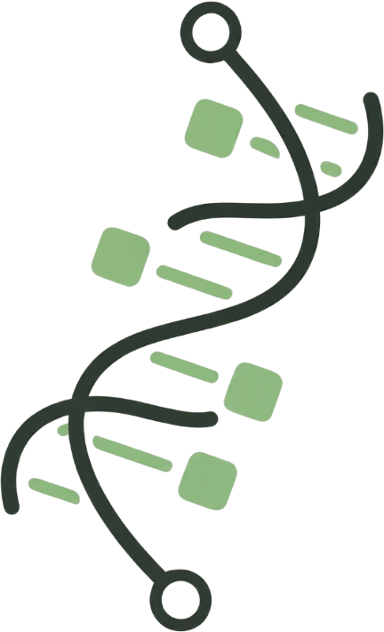

<table>
  <tr>
    <td width="120" valign="middle">
      
    </td>
    <td valign="middle">
      <h3>pyaptamer</h3>
      The python library for easy aptamer design.<br/>
      <strong>sponsored by ecoSPECS</strong>
    </td>
  </tr>
</table>

|  | **[Tutorials](https://github.com/gc-os-ai/pyaptamer/tree/main/examples)** · **[Issue Tracker](https://github.com/gc-os-ai/pyaptamer/issues)** · **[Project Board](https://github.com/orgs/gc-os-ai/projects/1)** |
|---|---|
| **Open Source** | [](https://github.com/gc-os-ai/pyaptamer/blob/main/LICENSE) [](https://gc-os-ai.github.io/) |
| **Community** | [](https://discord.gg/7uKdHfdcJG) [](https://www.linkedin.com/company/german-center-for-open-source-ai/) |
| **CI/CD** | [](https://github.com/gc-os-ai/pyaptamer/actions/workflows/release.yml) |
| **Code** | [](https://pypi.org/project/pyaptamer/) [](https://www.python.org/) [](https://github.com/psf/black) |

## 🌟 Features

- ✅ aptamer design and optimization algorithms
- ✅ feature extraction from proteins and compounds
- ✅ compatible with `pdb` and `biopython`
- ✅ `scikit-learn`-like API - standardized and composable
- 🛠️ Easily extendable with plugins
- 📦 Minimal dependencies

NOTE: the package is in early development, API is unstable and not 100% features are complete - contributions appreciated!

---

## 🛠️ Usage

Checkout [examples/](examples) to see how to use the current API.

---

## ⚡ Installation

### PyPI prerelease

```bash
pip install pyaptamer==0.1.0a1
```
NOTE: pyaptamer is in early development. The API is unstable and may change between releases.

### Development install

```bash
# Clone the repository
git clone https://github.com/gc-os-ai/pyaptamer.git

# Install dependencies
pip install -e .  # latest version
# or editable developer install
pip install -e ".[dev]"
```

---

## 🤝 Contributing

Contributions are welcome! 🎉

How to start: [find a good first issue](https://github.com/gc-os-ai/pyaptamer/issues?q=is%3Aissue%20state%3Aopen%20label%3A%22good%20first%20issue%22)

and/or join the [discord](https://discord.gg/7uKdHfdcJG) and ping the developers,
you can also ask for longer projects here.

Please open an issue before making a PR about bug/feature.

Contributions and participation are subject to the GC.OS Code of Conduct.

---

## 🗺️ Roadmap

* more complete set of aptamer design and protein feature algorithms
* wider support for `cif` and/or `biopandas`
* integration of first-principles simulation tools
* Community feedback integration - suggest features on the [issue tracker!](https://github.com/gc-os-ai/pyaptamer/issues)

---

#### Team

The package is maintained in collaboration between [ecoSPECS](https://ecospecs.de/en/) and the [German Center for Open Source AI](https://gcos.ai/).

* German Center for Open Source AI
    * Franz Kiraly ([@fkiraly](https://www.github.com/fkiraly)) - primary point of contact (package)
    * Simon Blanke ([@simonblanke](https://www.github.com/simonblanke))
* ecoSPECS
    * Dennis Kubiczek ([@KubiczekD](https://www.github.com/KubiczekD)) - primary point of contact (domain/aptamers)
    * Fatih Yolcu ([@fat1hy0](https://www.github.com/fat1hy0))
    * Jakob Birke ([@jabirke](https://www.github.com/jabirke))
    * Kerstin Moser ([@KerstinMoser](https://www.github.com/KerstinMoser))
* European Summer of Code contributors 2025
    * Matteo Pinna ([@nennomp](https://www.github.com/nennomp))
    * Satvik Mishra ([@satvshr](https://www.github.com/satvshr))
    * Siddharth ([@siddharth7113](https://www.github.com/siddharth7113))
