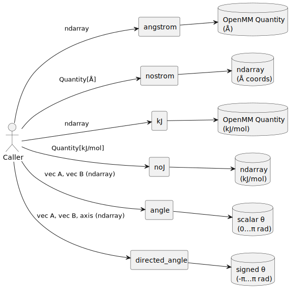

# `Helpers.py` — Developer Documentation

This module contains a small set of numerical utility functions that standardize unit conversions and compute geometric measures (e.g., angles) for molecular structures. These helpers are used throughout the aptamer modeling code to ensure consistent interaction with OpenMM unit-wrapped quantities and NumPy-based coordinate arrays.

## `angstrom(array)`

**Name of step**: Convert NumPy array to OpenMM distance in angstroms
**Input object type**: In-memory NumPy array
**Input object example**: `np.array([1.0, 2.0, 3.0])`
**Output object type**: In-memory `Quantity` object (with `unit.angstrom`)
**Output object example**: `<Quantity([1.0, 2.0, 3.0], angstrom)>`
**Steps performed**: Create unit-wrapped vector
**Package/code**: `openmm.unit`, function: `angstrom(array)`

## `nostrom(quantity)`

**Name of step**: Strip OpenMM distance units from angstrom-wrapped quantity
**Input object type**: In-memory `Quantity` with `unit.angstrom`
**Input object example**: `<Quantity([1.0, 2.0, 3.0], angstrom)>`
**Output object type**: In-memory NumPy array or scalar
**Output object example**: `np.array([1.0, 2.0, 3.0])`
**Steps performed**: Convert unit-bearing to plain numeric values
**Package/code**: `openmm.unit`, function: `nostrom(quantity)`

## `kJ(array)`

**Name of step**: Convert energy value to kilojoules/mole
**Input object type**: In-memory NumPy array or scalar
**Input object example**: `1.23` or `np.array([0.1, 0.2])`
**Output object type**: In-memory `Quantity` with `unit.kilojoules_per_mole`
**Output object example**: `<Quantity(1.23, kilojoule/mole)>`
**Steps performed**: Create unit-wrapped value
**Package/code**: `openmm.unit`, function: `kJ(array)`

## `noJ(quantity)`

**Name of step**: Strip OpenMM energy units from kilojoules/mole quantity
**Input object type**: In-memory `Quantity` with `unit.kilojoules_per_mole`
**Input object example**: `<Quantity(1.23, kilojoule/mole)>`
**Output object type**: In-memory float or array
**Output object example**: `1.23` or `np.array([0.1, 0.2])`
**Steps performed**: Convert unit-bearing to plain numeric values
**Package/code**: `openmm.unit`, function: `noJ(quantity)`

## `angle(array1, array2)`

**Name of step**: Compute angle (in radians) between two 3D vectors
**Input object type**: In-memory NumPy-like 3D vectors
**Input object example**: `array1 = [1, 0, 0]`, `array2 = [0, 1, 0]`
**Output object type**: In-memory float
**Output object example**: `1.5708` (≈π/2 radians)
**Steps performed**: Compute dot product, normalize, apply `arccos`, clamp with `np.clip`
**Package/code**: `numpy`, function: `angle(array1, array2)`

## `directed_angle(array1, array2, axis)`

**Name of step**: Compute signed angle between vectors projected on a plane defined by an axis
**Input object type**: In-memory NumPy-like 3D vectors
**Input object example**: `array1 = [1, 0, 0]`, `array2 = [0, 1, 0]`, `axis = [0, 0, 1]`
**Output object type**: In-memory float
**Output object example**: `1.5708` (positive indicates counterclockwise rotation around axis)
**Steps performed**: Normalize both vectors, compute `arctan2` using cross and dot product
**Package/code**: `numpy`, function: `directed_angle(array1, array2, axis)`
