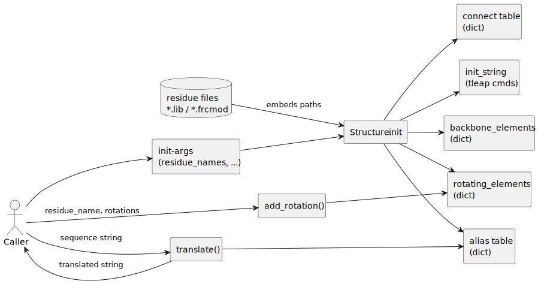

# `Structure.py` — Developer Documentation

This module defines the `Structure` class, which encapsulates the molecular configuration of residue-based molecules (e.g., aptamers). It provides abstractions over residue metadata, rotatable bonds, and backbone structure, ultimately constructing AMBER-style inputs like `.lib` and `.frcmod` files to support force field parametrization in molecular simulations.

The class is central to the input preprocessing pipeline and is responsible for converting high-level residue specifications into concrete AMBER configuration strings.

## Class: `Structure`

### Purpose

The `Structure` class acts as a configuration holder for all relevant molecular properties of the input aptamer or peptide sequence. This includes:

- Loading of residue parameter files (`.lib`, `.frcmod`)
- Mapping residue names to atom-level aliases
- Defining rotation and backbone behavior for energy minimization and conformational sampling



## Input Overview

Each input parameter plays a role in downstream dictionary definitions and `.init_string` generation.

```text
residue_names       → Residue types in the molecule
residue_length      → Number of atoms in each residue
rotating_elements   → Rotatable bond definitions per residue
backbone_elements   → Backbone torsion definitions per residue
connect             → Defines connectivity logic (e.g., end-to-end linkage)
residue_path        → File path to load residue data (.lib/.frcmod)
alias               → Defines how each residue is represented as 4 parts: [start, middle, ..., end]
```

## Input Object Examples

### File-Based Inputs

- `residue_path`:

  - Directory containing parameter files for each residue
  - Example files:

    - `./residues/A.lib`
    - `./residues/A.frcmod`

### In-Memory Inputs

```python
residue_names = ["A", "T"]

residue_length = [12, 14]

rotating_elements = [
    ("A", 1, 2, 5),
    ("T", -4, -3, -1)
]

backbone_elements = [
    ("A", 0, 1, 2, 3, 4),
    ("T", 0, 2, 3, 4, 5)
]

alias = [
    ("A", "A_N", "A_M", "A_M", "A_C"),
    ("T", "T_N", "T_M", "T_M", "T_C")
]
```

## Output Object Types and Examples

### In-Memory Outputs

#### `self.init_string`:

```text
loadoff ./residues/A.lib
loadamberparams ./residues/A.frcmod
loadoff ./residues/T.lib
loadamberparams ./residues/T.frcmod
```

#### `self.alias["T"]`:

```python
["T_N", "T_M", "T_M", "T_C"]
```

#### `self.rotating_elements["T"]`:

```python
[[10, 11, 13]]
```

#### `self.backbone_elements["A"]`:

```python
[[0, 1, 2], [3, 4]]
```

#### `self.connect["A"]` (default if not overridden):

```python
[[0, -1], [-2, 0], 1.6, 1.6]
```

## Flow of `__init__` (Step-by-Step)

### 1. Load Force Field Files

If `residue_path` is provided, build `init_string` by injecting each residue's `.lib` and `.frcmod`.

### 2. Store Residue Lengths

If `residue_length` is given, index it against `residue_names`. Required for index correction logic later.

### 3. Define Connectivity

If custom `connect` is passed, override default per residue.

### 4. Alias Table Construction

Sets `self.alias[residue] = [residue]*4` by default, unless overridden. Later used in `.translate()` for sequence transformation.

### 5. Rotatable Bonds

Initializes each residue to `[None]`. If a `rotating_elements` list is passed, each tuple is resolved into residue-specific triplets. Handles negative indices by converting them into positive offsets from residue end using `residue_length`.

### 6. Backbone Definition

Similarly, backbone torsions are stored as resolved index triplets, handling negative indices and defaulting to `None` if absent.

## Key Internal Attributes

### `self.init_string`

LEaP commands (as string) for each residue:

```bash
loadoff ./A.lib
loadamberparams ./A.frcmod
```

### `self.residue_length`

Mapping: `residue → atom count`

### `self.connect`

Default linkage:

```python
[[0, -1], [-2, 0], 1.6, 1.6]
```

### `self.alias`

Mapping for terminal modifications:

```python
["A_N", "A_M", "A_M", "A_C"]
```

### `self.rotating_elements`

Stores rotatable triplets like:

```python
[[1, 2, 5]]
```

### `self.backbone_elements`

Stores backbone tuples like:

```python
[[0, 1, 2], [3, 4]]
```

## Method: `add_rotation`

```python
add_rotation(residue_name, rotations, basestring)
```

Used to dynamically add new rotatable definitions to an existing residue. It appends them to the internal `rotating_elements` dict.

### Steps Performed:

- Create (if uninitialized)
- Modify (append new triplet entries)

## Method: `translate`

```python
translate("A B C D")
```

Uses `self.alias` to convert a space-separated sequence into a structured string, selecting specific alias parts:

```text
A_N A_M A_M A_C
```

### Steps Performed:

- Read from alias dict
- Construct and return composite string

---

## Notes

- **Negative Indexing**: Supported across rotation/backbone specs. Normalized using `residue_length`.
- **Missing Keys**: Internally handled via `defaultdict` fallbacks to prevent crashes.

## Example Use Case

```python
Structure(
    residue_names=["A", "T"],
    residue_length=[12, 14],
    rotating_elements=[
        ("A", 1, 2, 5),
        ("T", -4, -3, -1)
    ],
    backbone_elements=[
        ("A", 0, 1, 2, 3, 4),
        ("T", 0, 2, 3, 4, 5)
    ],
    residue_path="./residues",
    alias=[
        ("A", "A_N", "A_M", "A_M", "A_C"),
        ("T", "T_N", "T_M", "T_M", "T_C")
    ]
)
```

---
